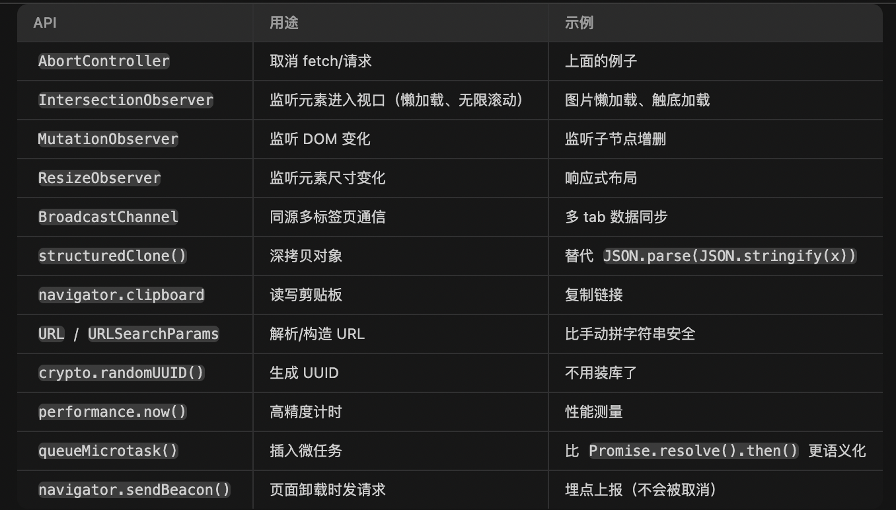

## 5.27 学习记录
# 单例模式
在ts里经典的单例模式
```ts
class Singleton {
    private static instance: Singleton;
    private constructor() {} // 私有构造函数，禁止外部 new
    static getInstance() {
        if (!this.instance) this.instance = new Singleton();
        return this.instance;
    }
}
```
百度项目里的实现
```ts
class TRequest {
    private static axiosInstance = Axios.create(config); // 唯一的 axios
    constructor() { ... } // 构造函数没有设为 private
}
export const http = new TRequest(); // 只导出一个实例
```
这里的构造函数不是 private，技术上可以 new TRequest() 多次
但因为 axiosInstance 是 static，即使 new 多次，用的也是同一个 axios 实例
最终只导出了 http 这一个实例，靠模块系统保证单例（其他文件 import 拿到的都是同一个 http）
所以更准确的说法是：这是一个"模块级单例" + "static 保证共享状态"的组合。实际效果和单例模式一样——全应用只有一个 HTTP 客户端实例。

# 浏览器新api


# 请求封装
## 请求取消封装
```ts
/* eslint-disable */
import { TAxiosRequestConfig } from './type';
import QsUtils from '@monorepo/nd-plugin-qs';

const pendingMap = new Map<string, AbortController>();

// 序列化参数，确保对象属性顺序一致
const sortedStringify = (obj: unknown) => {
    if (!obj) return '';
    return QsUtils.stringify(obj, {
        arrayFormat: 'repeat',
        sort: (a, b) => a.localeCompare(b)
    });
};

// 获取请求的唯一标识
export const getPendingUrl = (config: TAxiosRequestConfig) => {
    const { url, method, params, data } = config;
    return [url, method, sortedStringify(params), sortedStringify(data)].join('&');
};

export class AxiosCanceler {
    // 添加请求
    addPending(config: TAxiosRequestConfig) {
        this.removePending(config);
        const url = getPendingUrl(config);
        const controller = new AbortController();
        config.signal = controller.signal;
        pendingMap.set(url, controller);
    }

    // 移除请求
    removePending(config: TAxiosRequestConfig) {
        const url = getPendingUrl(config);
        if (pendingMap.has(url)) {
            const controller = pendingMap.get(url);
            if (controller) {
                controller.abort();
                pendingMap.delete(url);
            }
        }
    }

    // 移除所有请求
    removeAllPending() {
        pendingMap.forEach(controller => {
            controller.abort();
        });
        pendingMap.clear();
    }

    // 根据URL移除请求
    removeByUrl(url: string) {
        pendingMap.forEach((controller, pendingUrl) => {
            if (pendingUrl.includes(url)) {
                controller.abort();
                pendingMap.delete(pendingUrl);
            }
        });
    }
}
```
## 请求config封装
```ts
/* eslint-disable */
import { TAxiosRequestConfig, TAxiosError } from './type';

export enum ResultEnum {
    SUCCESS = 200,
    ERROR = 500,
    OVERDUE = 401,
    TIMEOUT = 10000,
    TYPE = 'success'
}

// 默认配置
export const defaultConfig: TAxiosRequestConfig = {
    baseURL: '',
    timeout: 10000,
    headers: {
        Accept: 'application/json, text/plain, */*',
        'Content-Type': 'application/json',
        'X-Requested-With': 'XMLHttpRequest'
    },
    loading: true,
    cancel: true
};

// 获取token
export function getToken(): string {
    return '';
}

// 添加token到请求头
export function addTokenToHeader(config: TAxiosRequestConfig): void {
    const token = getToken();
    if (token) {
        config.headers = config.headers || {};
        config.headers['Authorization'] = `Bearer ${token}`;
    }
}

// 显示加载动画
export function showLoading(config: TAxiosRequestConfig): void {
    if (config.loading) {
    }
}

// 隐藏加载动画
export function hideLoading(config: TAxiosRequestConfig): void {
    if (config.loading) {
    }
}

// 处理HTTP状态码
export function checkStatus(status: number): void {
    switch (status) {
        default:
    }
}

// 处理错误信息
export function handleNetworkError(error: TAxiosError): void {
    let message = '未知错误';
    if (error.message) {
        if (error.message.includes('timeout')) {
            message = '网络请求超时';
        } else if (error.message.includes('Network Error')) {
            message = '网络连接错误';
        } else {
            message = error.message;
        }
    }
}

// 处理业务错误
export function handleBusinessError(data: unknown): boolean {
    // 如果没有code，说明不是标准响应格式（如二进制流）
    // @ts-ignore
    if (!data || !data.code) {
        return false;
    }

    // 处理不同的业务状态码
    // @ts-ignore
    switch (data.code) {
        case ResultEnum.SUCCESS:
            return false;
        case ResultEnum.OVERDUE:
            // 这里可以处理登出逻辑
            localStorage.removeItem('token');
            return true;
        default:
            return true;
    }
}

```
## 请求index
```ts
/* eslint-disable */
import Axios, { AxiosInstance, AxiosRequestConfig } from 'axios';
import { TAxiosRequestConfig, TAxiosResponseConfig, TAxiosError } from './type';
import {
    defaultConfig,
    addTokenToHeader,
    showLoading,
    hideLoading,
    checkStatus,
    handleNetworkError,
    handleBusinessError
} from './config';
import { AxiosCanceler } from './axiosCancel';
import './sandbox.ts';

const isSandboxMode = window.__SANDBOX_MODE__?.isSandboxMode;
const sandboxID = window.__SANDBOX_MODE__?.sandboxID;

const getSandBoxAddress = (url: string): string => {
    if (typeof window.__sand_box__ === 'object') {
        return window.__sand_box__[url] || url;
    }
    return url;
};

/**
 * @description 请求封装
 * @example
 * const res = await http.get('/api/users')
 * const res = await http.post('/api/users', { name: 'John' })
 * const res = await http.put('/api/users', { name: 'John' })
 * const res = await http.delete('/api/users', { name: 'John' })
 * const res = await http.download('/api/users', { name: 'John' })
 * const res = await http.upload('/api/users', { name: 'John' })
 * @example 取消请求
 * http.cancelRequest('/api/users') // 取消指定URL的请求
 * http.cancelAllRequests() // 取消所有请求
 * http.showLoading() // 显示加载动画
 * http.hideLoading() // 隐藏加载动画
 */

// 创建取消请求实例
export const axioCanceler = new AxiosCanceler();

class TRequest {
    /* axios实例 */
    private static axiosInstance: AxiosInstance = Axios.create(defaultConfig);

    constructor() {
        this.setBaseURL();
        this.httpInterceptorsRequest();
        this.httpInterceptorsResponse();
    }
    private setBaseURL(): void {
        if (isSandboxMode && sandboxID) {
            // 沙盒模式
            TRequest.axiosInstance.defaults.baseURL = 'https://' + getSandBoxAddress('sandbox-pan.baidu-int.com');
        } else if (location.protocol === 'file:') {
            // 仅限正式环境，不是给测试用的环境
            TRequest.axiosInstance.defaults.baseURL = 'https://' + getSandBoxAddress('pan.baidu.com');
        }
    }
    /**
     * @description 批量取消请求
     * @example onUnMount(() => {http.cancelAllRequests()})
     */
    public cancelAllRequests(): void {
        axioCanceler.removeAllPending();
    }

    /**
     * @description 取消指定 URL 的请求
     * @param url
     * @example http.cancelRequest('/api/users');
     */
    public cancelRequest(url: string): void {
        axioCanceler.removeByUrl(url);
    }

    /** 请求拦截 */
    private httpInterceptorsRequest(): void {
        TRequest.axiosInstance.interceptors.request.use(
            // @ts-ignore
            (config: TAxiosRequestConfig): TAxiosRequestConfig | Promise<TAxiosRequestConfig> => {
                // 1. 针对单个请求的自定义回调
                if (typeof config.beforeRequestCallback === 'function') {
                    config = config.beforeRequestCallback(config);
                }
                // 2. 显示加载动画
                showLoading(config);
                // 3. 添加取消请求
                if (config.cancel) {
                    axioCanceler.addPending(config);
                }
                // 4. 添加token到请求头
                addTokenToHeader(config);
                // 5. 请求之前
                return Promise.resolve(config);
            },
            (error: TAxiosError) => {
                const config = error.config;
                // 6.隐藏loading
                hideLoading(config);
                return Promise.reject(error);
            }
        );
    }

    /** 响应拦截 */
    private httpInterceptorsResponse(): void {
        TRequest.axiosInstance.interceptors.response.use(
            (response: TAxiosResponseConfig) => {
                const { config, data } = response;

                // 执行响应前回调
                if (typeof config.beforeResponseCallback === 'function') {
                    // @ts-ignore
                    config.beforeResponseCallback(config);
                }

                // 隐藏加载动画
                hideLoading(config);

                // 处理业务错误
                if (handleBusinessError(data)) {
                    return Promise.reject(data);
                }

                // 请求完成后，删除对应的cancelToken
                if (config.cancel) {
                    axioCanceler.removePending(config);
                }

                // 响应成功
                return response.data;
            },
            (error: TAxiosError) => {
                // 响应错误
                const config = error.config;

                // 隐藏加载动画
                if (config) {
                    hideLoading(config);
                }

                // 请求出错时，也需要删除对应的cancelToken
                if (error.config && error.config.cancel) {
                    axioCanceler.removePending(error.config);
                }

                // 标记取消请求
                error.isCancelRequest = Axios.isCancel(error);

                // 处理网络错误
                if (!error.isCancelRequest) {
                    handleNetworkError(error);
                }

                // 处理HTTP状态码错误
                if (error.response) {
                    checkStatus(error.response.status);
                }

                // 处理断网情况
                if (!window.navigator.onLine) {
                    console.log('网络已断开，请检查网络连接');
                }

                return Promise.reject(error);
            }
        );
    }

    /** 常用方法封装 */
    public post<T, P>(url: string, params?: P, config?: TAxiosRequestConfig): Promise<T> {
        return TRequest.axiosInstance.post(url, params, config);
    }

    public get<T, P>(url: string, params?: P, config?: TAxiosRequestConfig): Promise<T> {
        return TRequest.axiosInstance.get(url, { params, ...config });
    }

    public put<T, P>(url: string, params?: AxiosRequestConfig<P>, config?: TAxiosRequestConfig): Promise<T> {
        return TRequest.axiosInstance.put(url, params, config);
    }

    public delete<T, P>(url: string, params?: AxiosRequestConfig<P>, config?: TAxiosRequestConfig): Promise<T> {
        return TRequest.axiosInstance.delete(url, { params, ...config });
    }

    public download<T, P>(url: string, params?: AxiosRequestConfig<P>, config?: TAxiosRequestConfig): Promise<T> {
        return TRequest.axiosInstance.post(url, params, {
            ...config,
            responseType: 'blob'
        });
    }

    public upload<T>(url: string, formData: FormData, config?: TAxiosRequestConfig): Promise<T> {
        return TRequest.axiosInstance.post(url, formData, {
            ...config,
            headers: {
                'Content-Type': 'multipart/form-data',
                ...((config?.headers as Record<string, unknown>) || {})
            }
        });
    }
}

export const http = new TRequest();

```