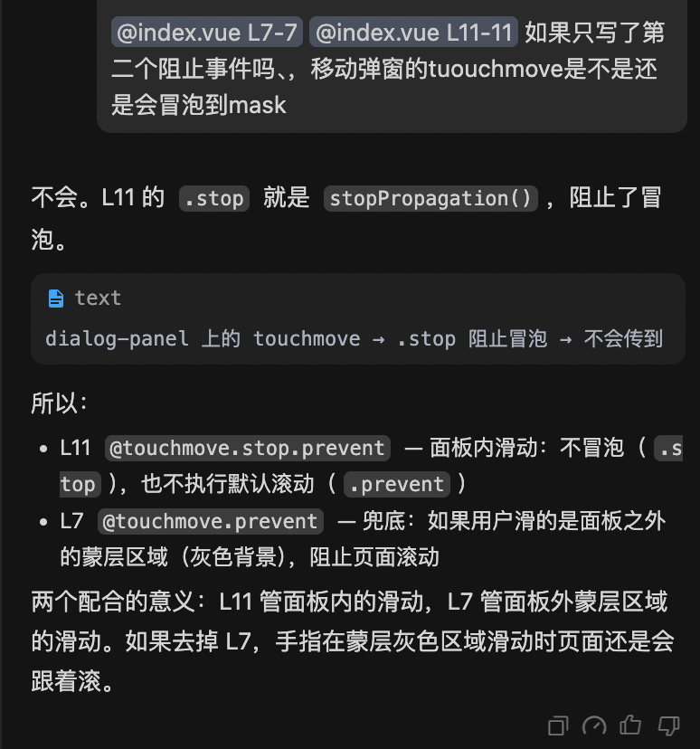
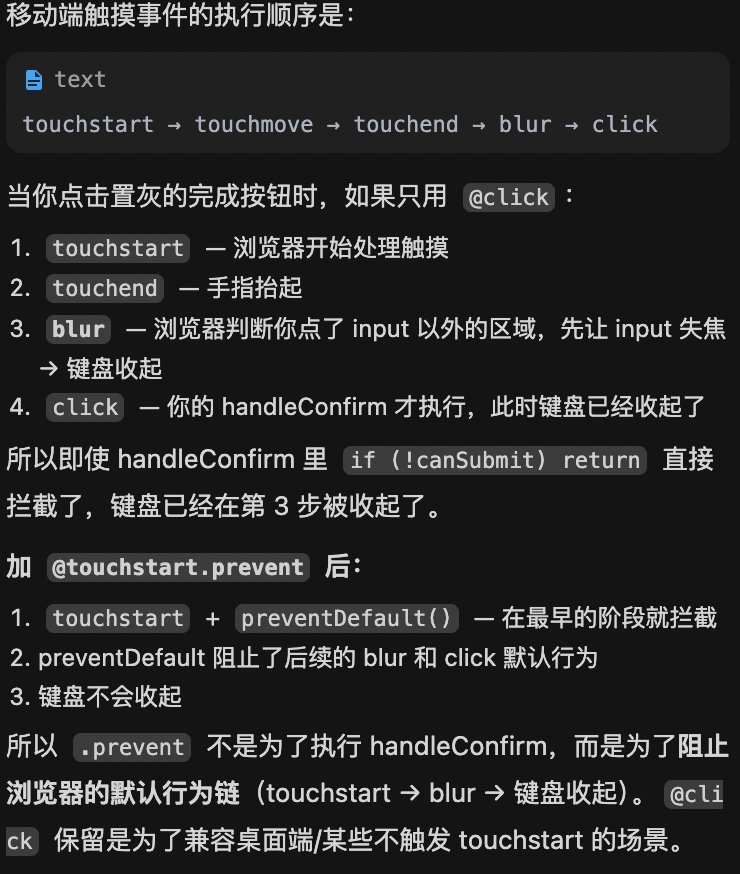

## 移动端封装公共弹窗解决兼容性问题

问题点：
1. 键盘弹出调的是端协议hybrid，这是异步的协议，首先inputRef.value?.focus();需要等待端看到键盘处理完成返回键盘高度。如果直接在inputRef.value?.focus();之后await getKeyboardHeight，端可能还没有处理完，导致键盘高度为0。
getKeyBoardHeight 调的是端侧协议，而键盘弹起是异步的。
调 focus 后键盘不会瞬间弹出，需要动画时间（通常 200-400ms）。如果 focus 后立即调一次 getKeyBoardHeight，端侧可能返回 0（键盘还没弹出来）。
2. 事件的处理。
## @click.self="handleClose" 蒙层
阻止弹窗点击事件的冒泡，防止点击弹窗内部触发关闭事件。

## @touchmove.prevent 弹窗（默认事件）
阻止蒙层触摸的默认移动事件，防止mask蒙层触发默认的触摸移动事件。

## @touchmove.stop.prevent 弹窗
阻止弹窗触摸移动事件的冒泡，防止弹窗外部触发触摸移动事件。

## @touchstart.prevent="handleConfirm" 确认按钮

InputDialog 当初加 @touchstart.prevent 是为了解决"置灰按钮点击导致键盘收起"的问题

<template>
    

        

            <!-- 顶部栏 -->
            

                

                    {{ cancelText }}
                

                
{{ title }}

                

                    {{ confirmText }}
                

            

            <!-- 输入框 -->
            

                <input
                    ref="inputRef"
                    v-model="inputValue"
                    class="name-input"
                    type="text"
                    :placeholder="placeholder"
                    :maxlength="maxlength"
                    @focus="handleInputFocus"
                />
            

            <!-- 底部提示区 -->
            

                

                    {{ showEmojiError ? '暂不支持输入表情' : (errorTip || '占位') }}
                

                
{{ inputValue.length }}/{{ maxlength }}

            

        

    

</template>

